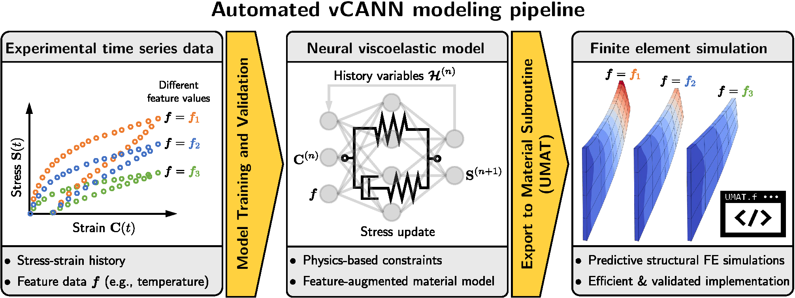
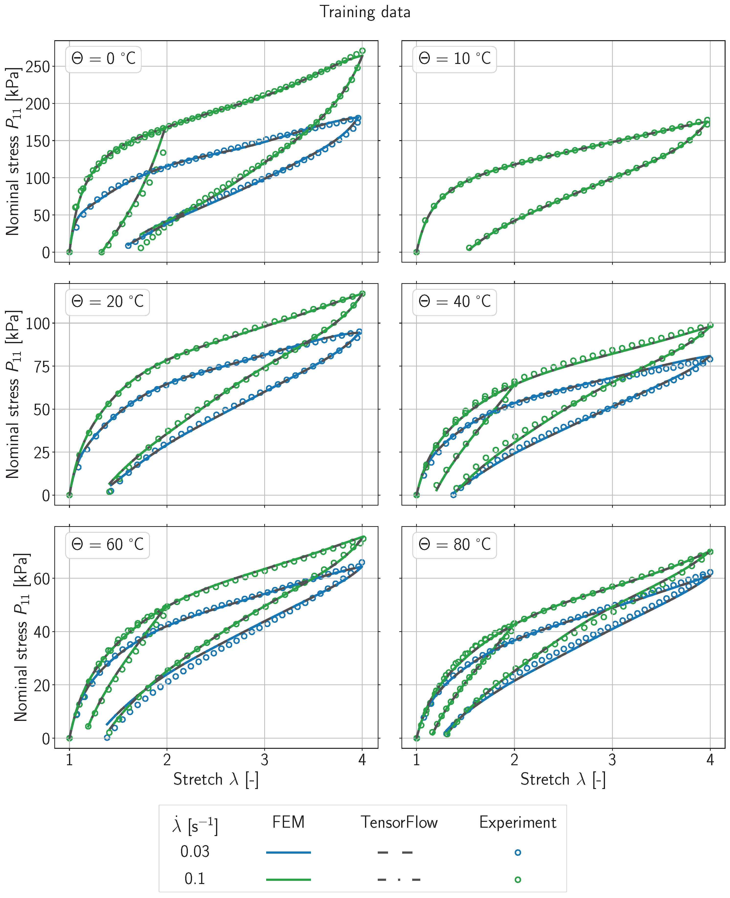
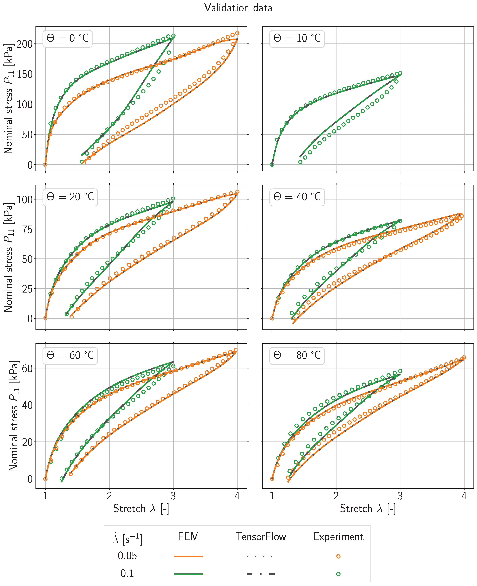

# vCANN_FEM

This is the GitHub repository for the paper  
["Thermodynamically consistent viscoelastic constitutive artificial neural networks: Automating the pipeline from experimental data to finite element simulations"](https://doi.org/10.1016/j.cma.2026.119080),  
K.P. Abdolazizi, R.C. Aydin, C.J. Cyron, K. Linka, *Computer Methods in Applied Mechanics and Engineering* **460**:119080, 2026.

  

In addition to the source code, this repository contains a minimal working example that illustrates most features of the automated pipeline using uniaxial loading–unloading data for VHB 4905 at different temperature levels, which is also used in Section 5.1 of the paper.

After training, the training and validation results should resemble the figures below.

  

  

